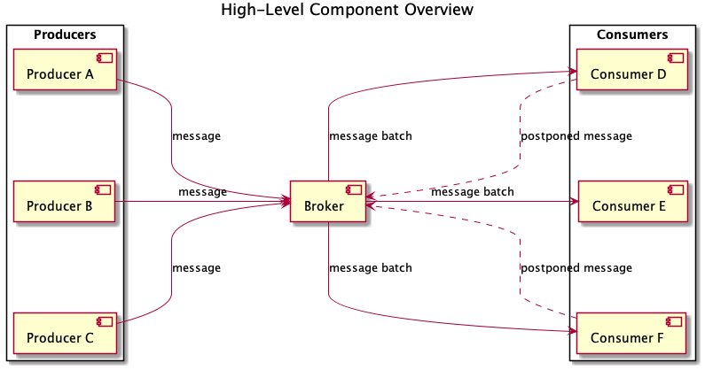

# Priority Message System

An exemplary implementation of a priority-message system.

Serves as an inspiration for introducing priority messages to systems that do not natively support transmission control.

## Introduction
The system has three types of components: a broker, a consumer, and a producer; one and only one broker might run, but there might exist multiple consumers and producers. These components exchange messages in an orderly fashion, taking into account transmission control information embedded in the messages.

### Message
A string containing data (agnostic to the system) and transmission control information. A message batch contains a handful of messages. The system sorts message by the time a broker accepted them.

### Broker
A broker accepts messages from producers and forwards them to consumers in constant intervals (cycles). The broker shall cease all operations if the associated message queue remains empty, or no consumers have registered, for a predefined number of cycles. The broker distributes messages in batches of predefined size using the round-robin algorithm. Only one consumer can receive a particular message.

### Consumer
Consumers accept message batches from the broker for processing. If a consumer cannot process a particular message, it can send that message back to the broker. Consumers might implement different strategies on how to deal with transmission control information.

### Producer
Producers send messages to the broker. Producers can arbitrarily set transmission control information on the message level.

## Consumer Strategies

### Predicate-based Consumer Strategy
Consumers with this strategy will only process messages that either:
* satisfy the predicate (a function that accepts a message and returns a boolean value) or
* have not been processed for a predefined number of predicate executions.

Consumers send every rejected message back to the broker with an incremented count of predicate runs against it.

### Priority-based Consumer Strategy
Consumers with this strategy will only process messages with their priority set above the priority threshold. Consumers send every rejected message back to the broker:
* with an incremented priority, if the message priority was too low,
* with a decremented priority, if the consumer could not process the message.

### TTL-based Consumer Strategy
Consumers with this strategy will only process messages with their TTL (Time-To-Live) within a specific range. Consumers will permanently reject messages with low TTL without sending them back to the broker; for messages with high TTL, consumers will send them back with a decremented TTL.

## Execution
The project requires Node.js and Yarn installed.

    yarn
    yarn test:unit
